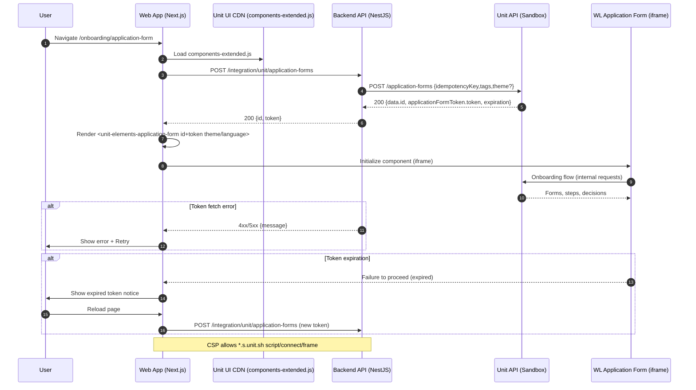

# Sequence Diagram — Unit Application Form Onboarding (Sandbox)

```mermaid
sequenceDiagram
  autonumber
  participant U as User
  participant W as Web App (Next.js)
  participant CDN as Unit UI CDN (components-extended.js)
  participant API as Backend API (NestJS)
  participant UNIT as Unit API (Sandbox)
  participant I as WL Application Form (iframe)

  U->>W: Navigate /onboarding/application-form
  W->>CDN: Load components-extended.js
  W->>API: POST /integration/unit/application-forms
  API->>UNIT: POST /application-forms {idempotencyKey,tags,theme?}
  UNIT-->>API: 200 {data.id, applicationFormToken.token, expiration}
  API-->>W: 200 {id, token}
  W->>W: Render <unit-elements-application-form id+token theme/language>
  W->>I: Initialize component (iframe)
  I->>UNIT: Onboarding flow (internal requests)
  UNIT-->>I: Forms, steps, decisions

  alt Token fetch error
    API-->>W: 4xx/5xx {message}
    W->>U: Show error + Retry
  end

  alt Token expiration
    I-->>W: Failure to proceed (expired)
    W->>U: Show expired token notice
    U->>W: Reload page
    W->>API: POST /integration/unit/application-forms (new token)
  end

  Note over W,API: CSP allows *.s.unit.sh script/connect/frame
```
