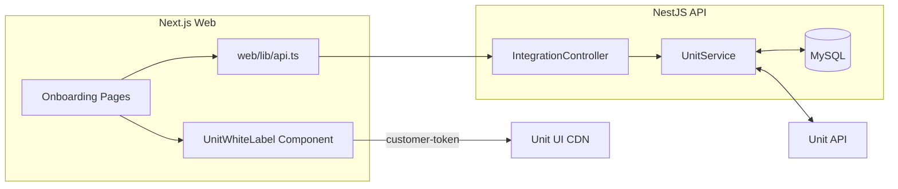
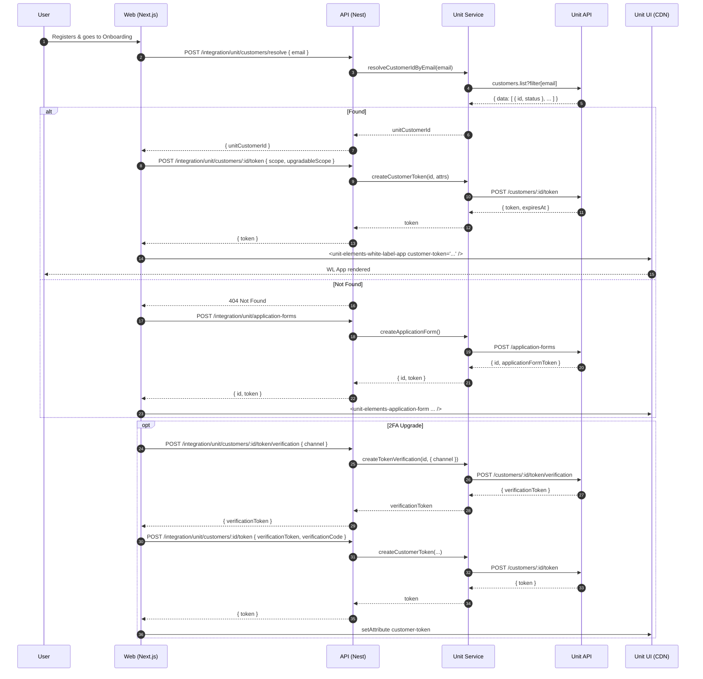

# Unit Onboarding to Dashboard — Design

Date: 2025-08-25
Owners: Platform Team
Status: Draft (awaiting approval)

## 1. Overview

Goal: Enable a seamless public registration → Unit onboarding → dashboard experience using Unit White‑Label UI. We will:
- Resolve or persist the Unit Customer for a registered user.
- Mint a Customer Token (JWT) for the White‑Label App with least‑privilege scopes and optional 2FA.
- Embed the White‑Label App on our dashboard/onboarding pages using `customer-token` per Unit docs.
- Fall back to Application Form embedding when a Customer does not yet exist.

References:
- White‑Label App docs: https://www.unit.co/docs/white-label-uis/white-label-app/
- Customer API Tokens: https://www.unit.co/docs/api/customer-api-tokens/
- Customers API: https://www.unit.co/docs/api/customers/
- SDK: `@unit-finance/unit-node-sdk` (customers, customerToken, applicationForms)

## 2. Architecture

Components (paths are from this repo):
- Frontend (Next.js)
  - `web/app/onboarding/application-form/page.tsx` — embeds Application Form token (existing).
  - `web/components/UnitWhiteLabel.tsx` — renders `<unit-elements-white-label-app>`.
  - `web/lib/api.ts` — API client for backend; to be extended for new endpoints.
  - `web/lib/unit.ts` — script src resolver, localStorage cleanup.
- Backend (NestJS)
  - `src/integration/unit.service.ts` — Unit API SDK + direct HTTP helper (existing Application Form); will add customer resolution + token minting.
  - `src/integration/integration.controller.ts` — exposes Unit integration endpoints; will add customer resolve + token endpoints.
  - `src/entities/user.entity.ts` — will add `unit_customer_id` to map our user → Unit customer.
  - `src/migrations/` — new SQL migration to alter `users` table.
- External
  - Unit API: base URL `UNIT_BASE_URL` (default Sandbox: https://api.s.unit.sh).
  - Unit White‑Label UI CDN: Sandbox `https://ui.s.unit.sh/release/latest/components-extended.js`.
  - MySQL database (existing).

### 2.1 Component Diagram


### 2.2 Deployment Diagram
```mermaid
flowchart LR
  Browser -- HTTPS --> NextJS[Next.js (Vercel/Docker)]
  NextJS -- HTTPS (REST) --> Nest[NestJS API (Docker/K8s)]
  Nest -- 3306/TCP --> MySQL[(MySQL)]
  Nest -- HTTPS --> UnitAPI[api.s.unit.sh]
  Browser -- HTTPS (script) --> UnitUICDN[ui.s.unit.sh]
```

### 2.3 Sequence Diagram (End‑to‑End)


## 3. Data Model & Schema

- Table: `users`
  - New column: `unit_customer_id VARCHAR(64) NULL UNIQUE`
  - Purpose: Persist 1:1 mapping to Unit Customer after first resolution.
  - Migration: add column + unique index; backfill none (nullable).

- Bank tables: already extended for Unit counterparties per `1703123456789-add-unit-columns.sql`.

## 4. API Contracts (Backend)

Base path: `/integration/unit`

- POST `/customers/resolve`
  - Request: `{ email: string, userId?: number }`
  - 200: `{ unitCustomerId: string, status?: 'Active' | 'Archived' }`
  - 404: `{ message: 'Customer not found' }`
  - Side‑effect: if `userId` provided (or later inferred from auth), persist `users.unit_customer_id`.

- POST `/customers/:id/token`
  - Request body example:
    ```json
    {
      "scope": "customers accounts cards transactions",
      "upgradableScope": "payments cards-write",
      "expiresIn": 3600,
      "verificationToken": "optional",
      "verificationCode": "optional",
      "jwtToken": "optional (JWT SSO path)",
      "resources": [{ "type": "account", "ids": ["123"] }]
    }
    ```
  - 200: `{ token: string, expiresAt?: string }`
  - Errors: 400 invalid scope; 401 if verification required; 5xx on Unit failure.

- POST `/customers/:id/token/verification`
  - Request: `{ channel: 'sms' | 'call', phone?: { countryCode: string, number: string }, appHash?: string }`
  - 200: `{ verificationToken: string }`

- POST `/application-forms` (existing)
  - Request: `{ tags?: Record<string,string>, whiteLabelThemeId?: string }`
  - 200: `{ id: string, token: string, expiration?: string }`

## 5. Backend Design Details

- `UnitService` (`src/integration/unit.service.ts`)
  - Add `resolveCustomerIdByEmail(email: string)` using `unit.customers.list({ email, limit: 1 })` — prefer Active.
  - Add `createCustomerToken(customerId: string, attrs: CreateTokenRequest['attributes'])` via `unit.customerToken.createToken()`.
  - Add `createCustomerTokenVerification(customerId: string, attrs)` via `unit.customerToken.createTokenVerification()`.
  - Timeouts: wrap SDK calls in 5s race (consistent with `checkStatus()`).
  - API key resolution: reuse current DB→env fallback logic.

- `IntegrationController` (`src/integration/integration.controller.ts`)
  - Add routes for resolve, token, token verification with proper DTOs and validation.
  - Persist `users.unit_customer_id` when available.

- Database
  - SQL migration to alter `users` table and add unique index.

## 6. Frontend Design Details

- `UnitWhiteLabel.tsx`
  - Accept `customerToken?: string` in addition to `jwtToken?`.
  - Render `<unit-elements-white-label-app customer-token=...>` when present; else `jwt-token` fallback.

- `web/lib/api.ts`
  - Add helpers:
    - `resolveUnitCustomer(email)` → calls POST `/integration/unit/customers/resolve`.
    - `createCustomerToken(customerId, payload)` and `createCustomerTokenVerification(customerId, payload)`.

- Onboarding flow
  - Try resolve → if found → mint token → embed WL App.
  - If not found → continue existing Application Form embed → upon approval, user returns to page; repeat resolve → mint.

- Storage & cleanup
  - WL App writes `unitCustomerToken` and `unitVerifiedCustomerToken` to localStorage; we already clear them on logout via `clearUnitStorage()` in `web/lib/unit.ts`.

## 7. Scopes & Security

- Default scopes for initial (read‑only) experience: `customers accounts cards transactions`.
- Upgradable scopes (2FA required): `payments cards-write`.
- Token lifetime: `expiresIn` ≤ 24h; default 1h for web session parity.
- Two‑factor: use `/token/verification` → returns `verificationToken`, then `/token` with `verificationToken` + `verificationCode`.
- CORS: already configured in `src/main.ts` for localhost + docker; ensure production origins are set.
- Secrets: `UNIT_API_KEY` stored in DB via `ApiKeysService` with env fallback.
- PII: Do not log raw email/phone/ids; redact in logs.
- Client storage: we do not persist the minted customer token ourselves; WL App manages its localStorage keys.

## 8. Error Handling

- Wrap all Unit SDK calls with 5s timeout; surface `UnitError` details as concise messages.
- Map Not Found to 404 for resolve; map auth/2FA failures to 401/403; other errors 5xx.
- Frontend: show actionable alerts for token expiration (401 from WL App), and refresh path.

## 9. Deployment Plan

- Env vars:
  - Backend: `UNIT_BASE_URL` (default Sandbox), `UNIT_API_KEY` (fallback), DB creds, `ALLOW_PUBLIC_REGISTRATION`.
  - Frontend: `NEXT_PUBLIC_API_URL`, optional `NEXT_PUBLIC_UNIT_THEME_URL`, `NEXT_PUBLIC_UNIT_LANGUAGE_URL`.
- Docker Compose:
  - Ensure API exposes CORS to web service origin; set envs as in `docker-compose.yml`.
- Migrations:
  - Run `ts-node scripts/run-migrations.ts` (or npm script) during bootstrap.
- CI/CD:
  - Stages: lint, test, build, migrate, deploy.

## 10. Testing Strategy

- Unit tests: `UnitService` customer resolve, token minting (mock SDK), error paths, timeouts.
- Integration tests: controller DTO validation, 404/401 mapping.
- E2E:
  - Registration → Application Form embed
  - Post‑approval → resolve → mint token → WL App renders
  - 2FA upgrade flow (sms) → verified token minted → WL actions allowed
- Frontend tests: rendering with `customer-token`, token expiration alert, storage cleanup.

## 11. Rollout & Backout

- Feature can be dark‑launched by gating WL App embed behind a toggle while Application Form remains default.
- Backout: disable WL App token minting endpoints; onboarding remains with Application Form.

## 12. Open Questions

- Do we want to infer `userId` from auth context now or after `.plan/user-login` tasks? (For now, controller accepts `userId` or remains public utility for dev.)
- Finalize scopes for MVP vs. GA (payments/cards‑write may remain behind 2FA only).
