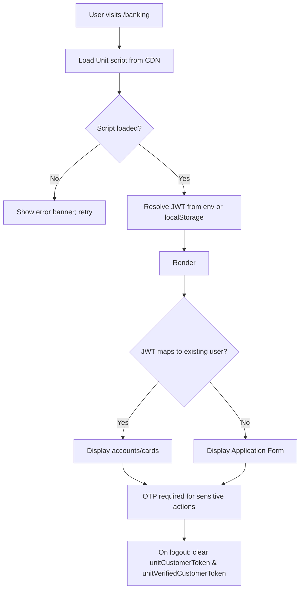

# White‑Label UI — Flowchart

```mermaid
flowchart TD
    A[User visits /banking] --> B[Load Unit script from CDN]
    B --> C{Script loaded?}
    C -- No --> E[Show error banner; retry]
    C -- Yes --> D[Resolve JWT from env or localStorage]
    D --> F[Render <unit-elements-white-label-app jwt-token=...>]
    F --> G{JWT maps to existing user?}
    G -- Yes --> H[Display accounts/cards]
    G -- No --> I[Display Application Form]
    H --> J[OTP required for sensitive actions]
    I --> J
    J --> K[On logout: clear unitCustomerToken & unitVerifiedCustomerToken]
```