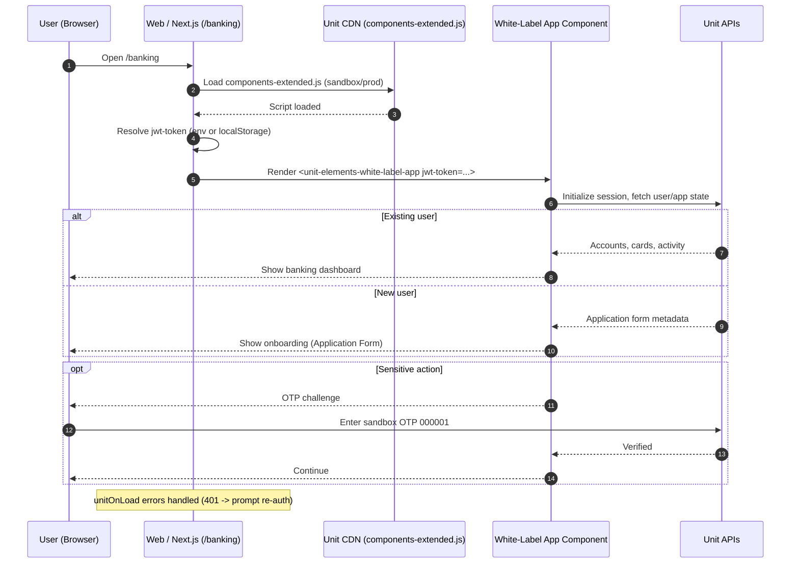

# White‑Label UI — Sequence Diagram

```mermaid
sequenceDiagram
  autonumber
  participant U as User (Browser)
  participant W as Web / Next.js (/banking)
  participant C as Unit CDN (components-extended.js)
  participant A as White-Label App Component
  participant API as Unit APIs

  U->>W: Open /banking
  W->>C: Load components-extended.js (sandbox/prod)
  C-->>W: Script loaded
  W->>W: Resolve jwt-token (env or localStorage)
  W->>A: Render <unit-elements-white-label-app jwt-token=...>
  A->>API: Initialize session, fetch user/app state
  alt Existing user
    API-->>A: Accounts, cards, activity
    A-->>U: Show banking dashboard
  else New user
    API-->>A: Application form metadata
    A-->>U: Show onboarding (Application Form)
  end
  opt Sensitive action
    A-->>U: OTP challenge
    U->>API: Enter sandbox OTP 000001
    API-->>A: Verified
    A-->>U: Continue
  end
  note over W: unitOnLoad errors handled (401 -> prompt re-auth)
```