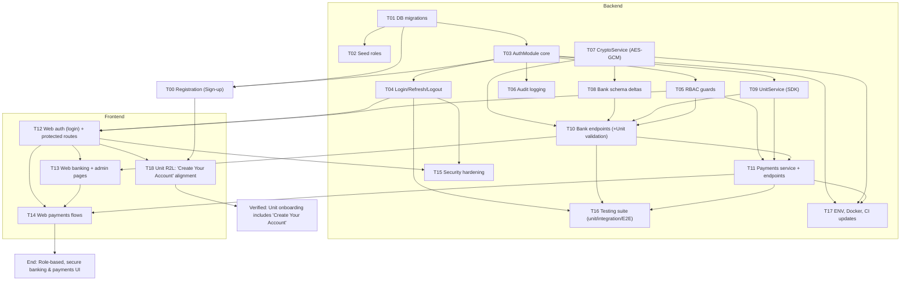

# User Login & Registration — Unified Flowchart

```mermaid
flowchart TD
  %% Nodes
  T00["T00 Registration (Sign-up)"]
  T01["T01 DB migrations"]
  T02["T02 Seed roles"]
  T03["T03 AuthModule core"]
  T04["T04 Login/Refresh/Logout"]
  T05["T05 RBAC guards"]
  T06["T06 Audit logging"]
  T07["T07 CryptoService (AES-GCM)"]
  T08["T08 Bank schema deltas"]
  T09["T09 UnitService (SDK)"]
  T10["T10 Bank endpoints (+Unit validation)"]
  T11["T11 Payments service + endpoints"]
  T12["T12 Web auth (login) + protected routes"]
  T13["T13 Web banking + admin pages"]
  T14["T14 Web payments flows"]
  T15["T15 Security hardening"]
  T16["T16 Testing suite (unit/integration/E2E)"]
  T17["T17 ENV, Docker, CI updates"]
  T18["T18 Unit R2L: 'Create Your Account' alignment"]

  %% Dependencies
  T01 --> T02
  T01 --> T03
  T03 --> T04
  T03 --> T05
  T03 --> T06
  T07 --> T08
  T03 --> T09
  T07 --> T10
  T08 --> T10
  T09 --> T10
  T05 --> T10
  T05 --> T11
  T09 --> T11
  T10 --> T11
  T04 --> T12
  T05 --> T12
  T10 --> T13
  T12 --> T13
  T11 --> T14
  T12 --> T14
  T13 --> T14
  T04 --> T15
  T12 --> T15
  T04 --> T16
  T10 --> T16
  T11 --> T16
  T03 --> T17
  T07 --> T17
  T11 --> T17
  T01 --> T00
  T03 --> T00
  T12 --> T18
  T00 --> T18

  %% Swimlane-ish grouping
  subgraph Backend
    T01; T02; T03; T04; T05; T06; T07; T08; T09; T10; T11; T15; T16; T17
  end
  subgraph Frontend
    T12; T13; T14; T18
  end

  %% Outcomes
  T14 --> O1["End: Role-based, secure banking & payments UI"]
  T18 --> O2["Verified: Unit onboarding includes 'Create Your Account'"]
```