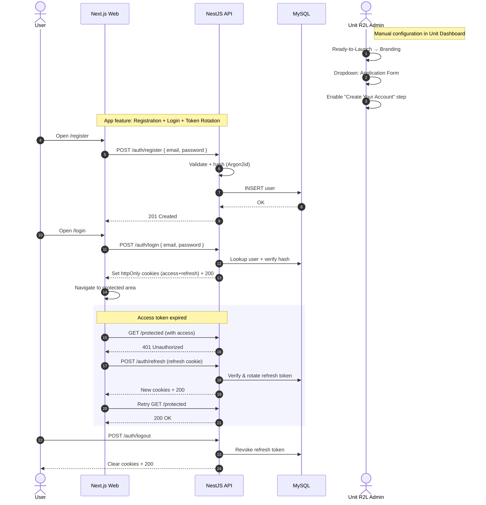

# User Login & Registration — Unified Sequence Diagram

```mermaid
sequenceDiagram
    autonumber
    actor User
    participant Web as Next.js Web
    participant API as NestJS API
    participant DB as MySQL
    actor UnitAdmin as Unit R2L Admin

    Note right of UnitAdmin: Manual configuration in Unit Dashboard
    UnitAdmin->>UnitAdmin: Ready‑to‑Launch → Branding
    UnitAdmin->>UnitAdmin: Dropdown: Application Form
    UnitAdmin->>UnitAdmin: Enable "Create Your Account" step

    Note over Web,API: App feature: Registration + Login + Token Rotation
    User->>Web: Open /register
    Web->>API: POST /auth/register { email, password }
    API->>API: Validate + hash (Argon2id)
    API->>DB: INSERT user
    DB-->>API: OK
    API-->>Web: 201 Created

    User->>Web: Open /login
    Web->>API: POST /auth/login { email, password }
    API->>DB: Lookup user + verify hash
    API-->>Web: Set httpOnly cookies (access+refresh) + 200
    Web->>Web: Navigate to protected area

    rect rgba(200,200,255,0.2)
    Note over Web,API: Access token expired
    Web->>API: GET /protected (with access)
    API-->>Web: 401 Unauthorized
    Web->>API: POST /auth/refresh (refresh cookie)
    API->>DB: Verify & rotate refresh token
    API-->>Web: New cookies + 200
    Web->>API: Retry GET /protected
    API-->>Web: 200 OK
    end

    User->>API: POST /auth/logout
    API->>DB: Revoke refresh token
    API-->>User: Clear cookies + 200
```
