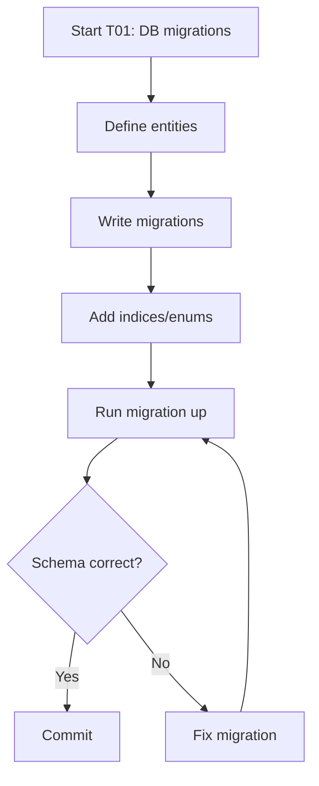

```mermaid
flowchart TD
  A[Start T01: DB migrations] --> B[Define entities]
  B --> C[Write migrations]
  C --> D[Add indices/enums]
  D --> E[Run migration up]
  E --> F{Schema correct?}
  F -- Yes --> G[Commit]
  F -- No --> H[Fix migration]
  H --> E
```
