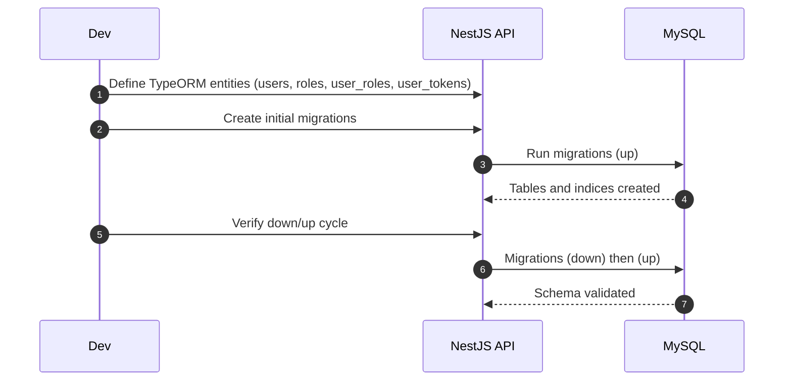

```mermaid
sequenceDiagram
  autonumber
  participant Dev
  participant API as NestJS API
  participant DB as MySQL
  Dev->>API: Define TypeORM entities (users, roles, user_roles, user_tokens)
  Dev->>API: Create initial migrations
  API->>DB: Run migrations (up)
  DB-->>API: Tables and indices created
  Dev->>API: Verify down/up cycle
  API->>DB: Migrations (down) then (up)
  DB-->>API: Schema validated
```
