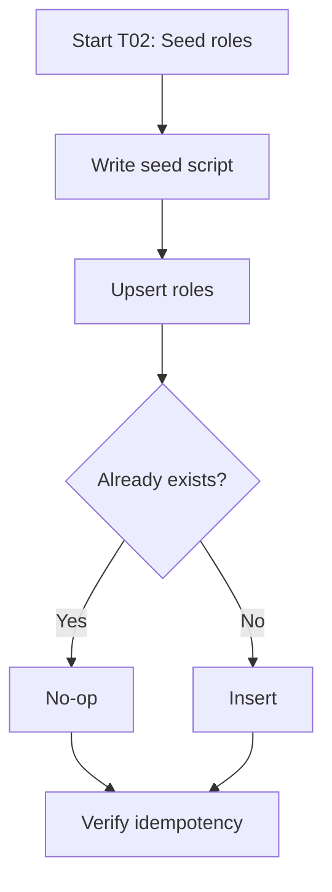

```mermaid
flowchart TD
  A[Start T02: Seed roles] --> B[Write seed script]
  B --> C[Upsert roles]
  C --> D{Already exists?}
  D -- Yes --> E[No-op]
  D -- No --> F[Insert]
  E --> G[Verify idempotency]
  F --> G[Verify idempotency]
```
