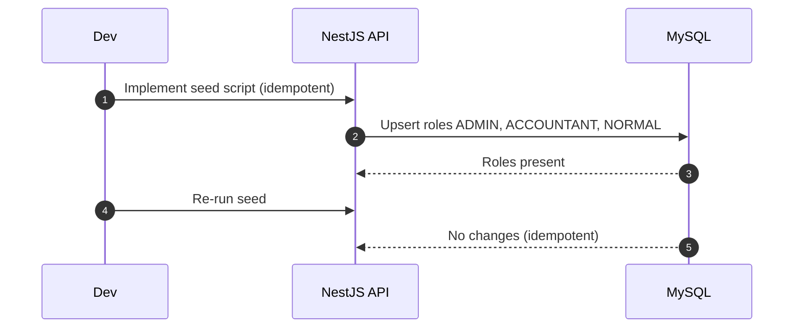

```mermaid
sequenceDiagram
  autonumber
  participant Dev
  participant API as NestJS API
  participant DB as MySQL
  Dev->>API: Implement seed script (idempotent)
  API->>DB: Upsert roles ADMIN, ACCOUNTANT, NORMAL
  DB-->>API: Roles present
  Dev->>API: Re-run seed
  DB-->>API: No changes (idempotent)
```
