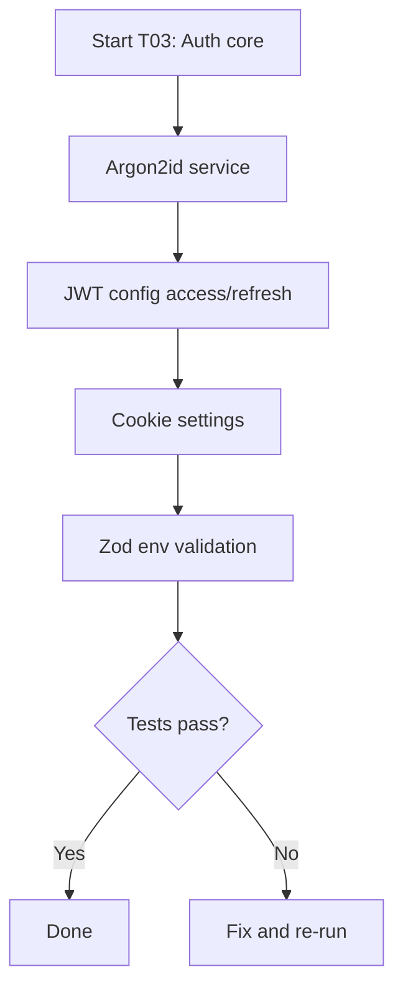

```mermaid
flowchart TD
  A[Start T03: Auth core] --> B[Argon2id service]
  B --> C[JWT config access/refresh]
  C --> D[Cookie settings]
  D --> E[Zod env validation]
  E --> F{Tests pass?}
  F -- Yes --> G[Done]
  F -- No --> H[Fix and re-run]
```
