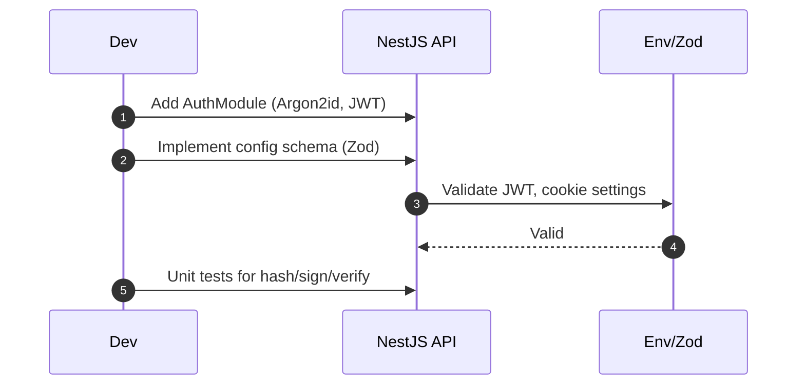

```mermaid
sequenceDiagram
  autonumber
  participant Dev
  participant API as NestJS API
  participant Config as Env/Zod
  Dev->>API: Add AuthModule (Argon2id, JWT)
  Dev->>API: Implement config schema (Zod)
  API->>Config: Validate JWT, cookie settings
  Config-->>API: Valid
  Dev->>API: Unit tests for hash/sign/verify
```
