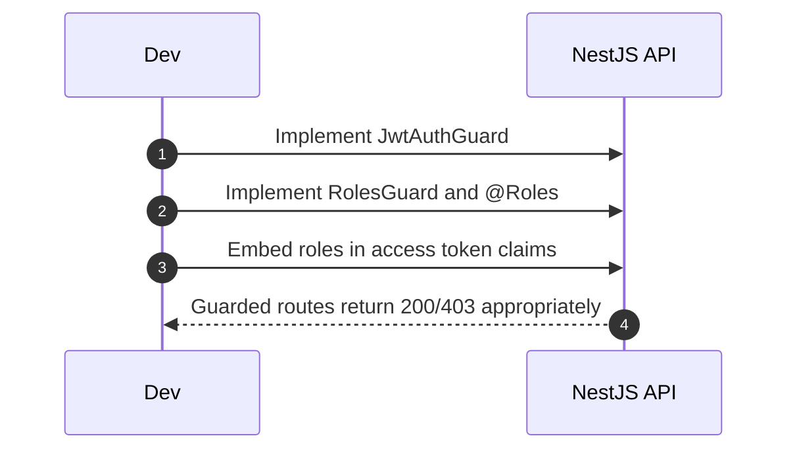

```mermaid
sequenceDiagram
  autonumber
  participant Dev
  participant API as NestJS API
  Dev->>API: Implement JwtAuthGuard
  Dev->>API: Implement RolesGuard and @Roles
  Dev->>API: Embed roles in access token claims
  API-->>Dev: Guarded routes return 200/403 appropriately
```
