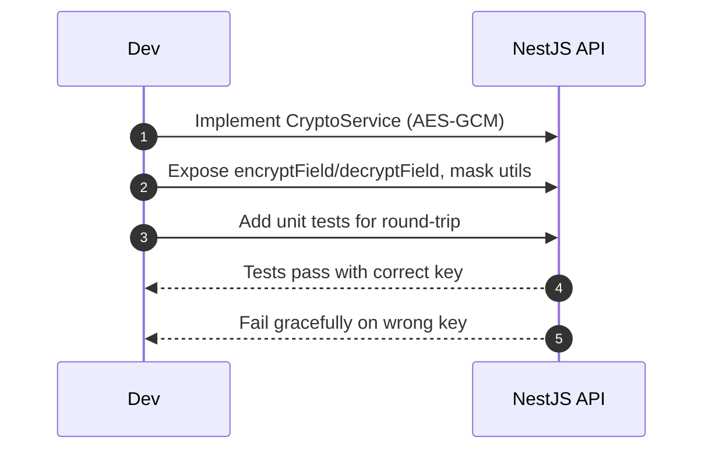

```mermaid
sequenceDiagram
  autonumber
  participant Dev
  participant API as NestJS API
  Dev->>API: Implement CryptoService (AES-GCM)
  Dev->>API: Expose encryptField/decryptField, mask utils
  Dev->>API: Add unit tests for round-trip
  API-->>Dev: Tests pass with correct key
  API-->>Dev: Fail gracefully on wrong key
```
