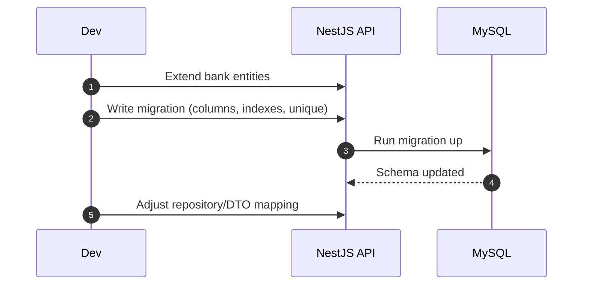

```mermaid
sequenceDiagram
  autonumber
  participant Dev
  participant API as NestJS API
  participant DB as MySQL
  Dev->>API: Extend bank entities
  Dev->>API: Write migration (columns, indexes, unique)
  API->>DB: Run migration up
  DB-->>API: Schema updated
  Dev->>API: Adjust repository/DTO mapping
```
