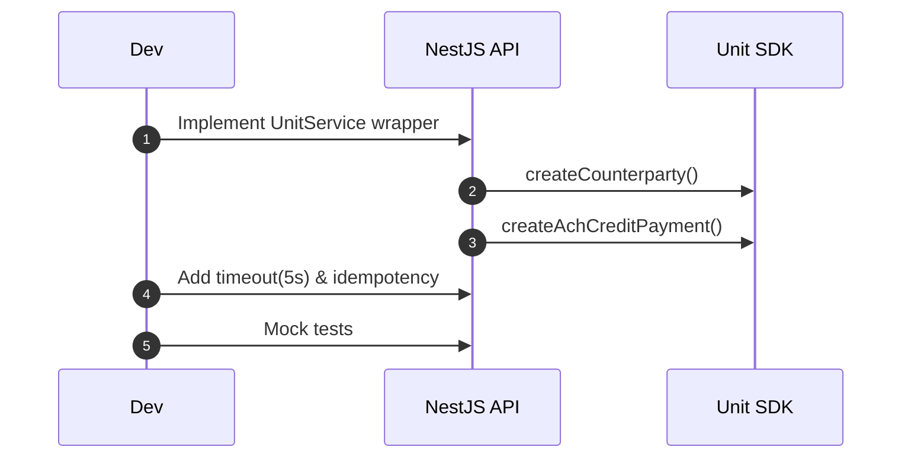

```mermaid
sequenceDiagram
  autonumber
  participant Dev
  participant API as NestJS API
  participant Unit as Unit SDK
  Dev->>API: Implement UnitService wrapper
  API->>Unit: createCounterparty()
  API->>Unit: createAchCreditPayment()
  Dev->>API: Add timeout(5s) & idempotency
  Dev->>API: Mock tests
```
