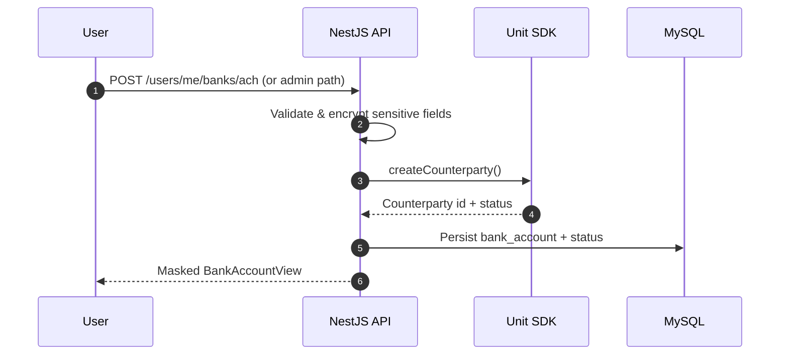

```mermaid
sequenceDiagram
  autonumber
  participant User
  participant API as NestJS API
  participant Unit as Unit SDK
  participant DB as MySQL
  User->>API: POST /users/me/banks/ach (or admin path)
  API->>API: Validate & encrypt sensitive fields
  API->>Unit: createCounterparty()
  Unit-->>API: Counterparty id + status
  API->>DB: Persist bank_account + status
  API-->>User: Masked BankAccountView
```
