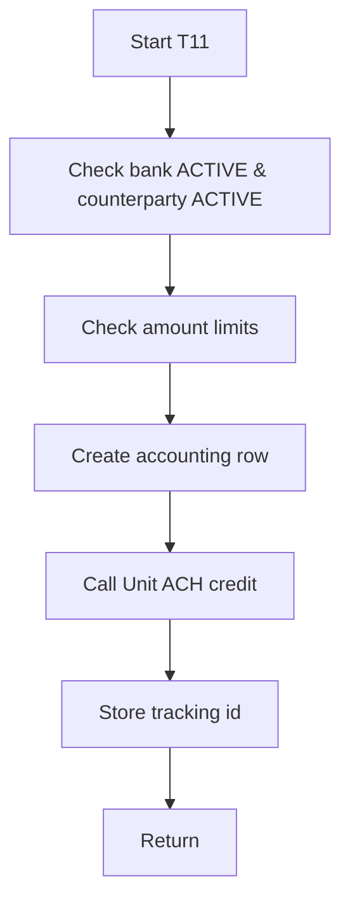

```mermaid
flowchart TD
  A[Start T11] --> B[Check bank ACTIVE & counterparty ACTIVE]
  B --> C[Check amount limits]
  C --> D[Create accounting row]
  D --> E[Call Unit ACH credit]
  E --> F[Store tracking id]
  F --> G[Return]
```
