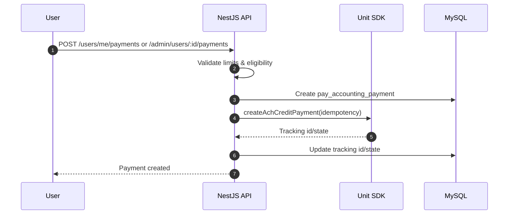

```mermaid
sequenceDiagram
  autonumber
  participant User
  participant API as NestJS API
  participant Unit as Unit SDK
  participant DB as MySQL
  User->>API: POST /users/me/payments or /admin/users/:id/payments
  API->>API: Validate limits & eligibility
  API->>DB: Create pay_accounting_payment
  API->>Unit: createAchCreditPayment(idempotency)
  Unit-->>API: Tracking id/state
  API->>DB: Update tracking id/state
  API-->>User: Payment created
```
