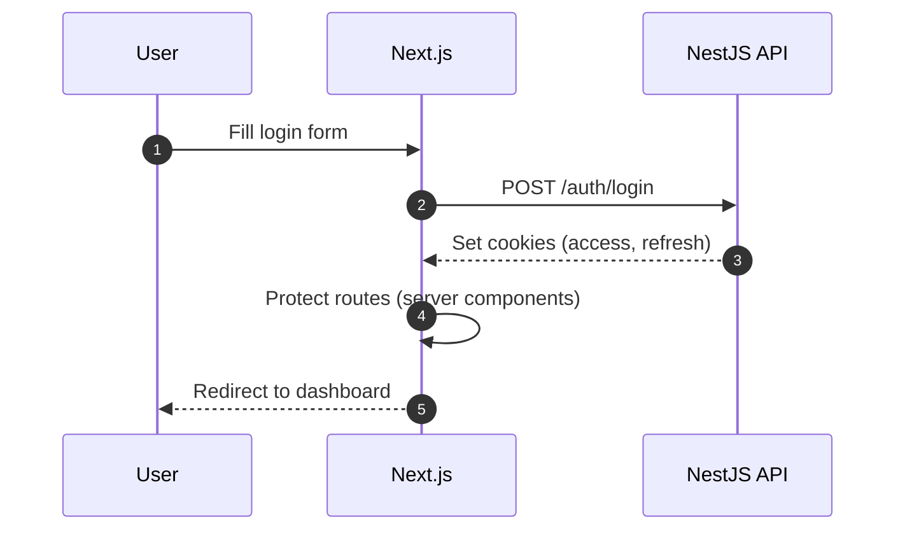

```mermaid
sequenceDiagram
  autonumber
  participant User
  participant Web as Next.js
  participant API as NestJS API
  User->>Web: Fill login form
  Web->>API: POST /auth/login
  API-->>Web: Set cookies (access, refresh)
  Web->>Web: Protect routes (server components)
  Web-->>User: Redirect to dashboard
```
