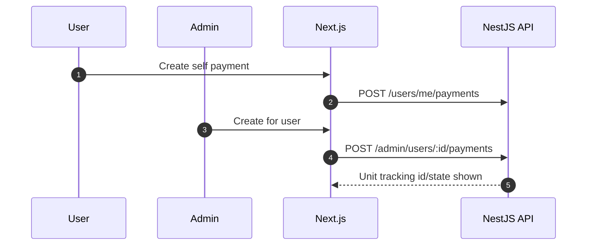

```mermaid
sequenceDiagram
  autonumber
  participant User
  participant Admin
  participant Web as Next.js
  participant API as NestJS API
  User->>Web: Create self payment
  Web->>API: POST /users/me/payments
  Admin->>Web: Create for user
  Web->>API: POST /admin/users/:id/payments
  API-->>Web: Unit tracking id/state shown
```
