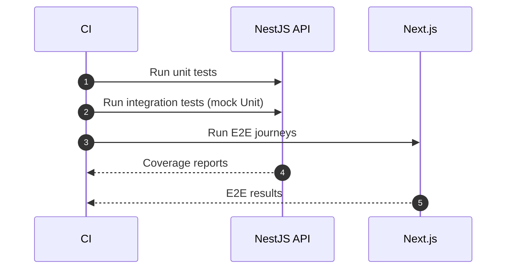

```mermaid
sequenceDiagram
  autonumber
  participant CI
  participant API as NestJS API
  participant Web as Next.js
  CI->>API: Run unit tests
  CI->>API: Run integration tests (mock Unit)
  CI->>Web: Run E2E journeys
  API-->>CI: Coverage reports
  Web-->>CI: E2E results
```
